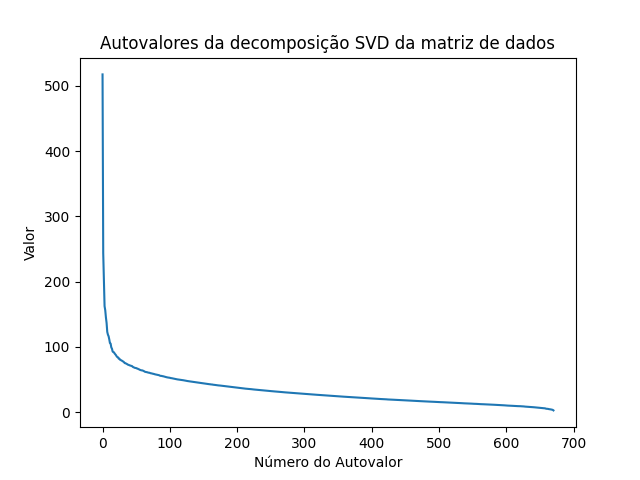
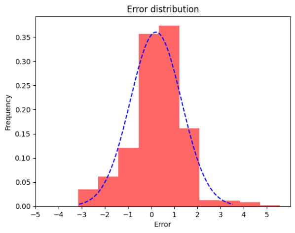
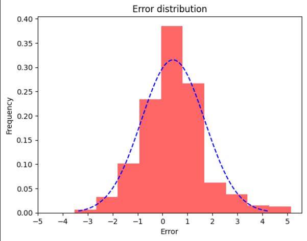
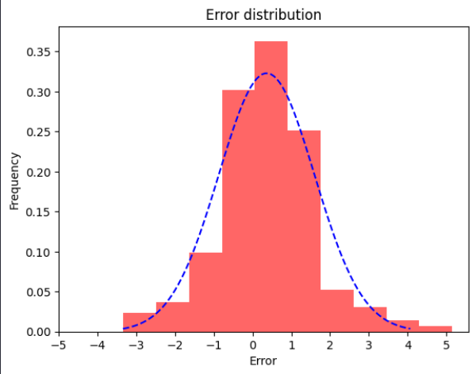
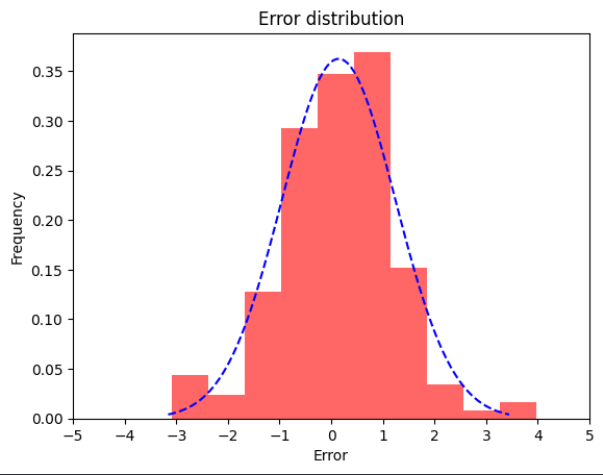

# Netflix_Challenge
## Programming Logic and Linear Algebra Project, utilizing eigenvalue and eigenvector concepts

Developers:

* João Lucas de Moraes Barros Cadorniga [JoaoLucasMBC](https://github.com/JoaoLucasMBC)  
* Eduardo Mendes Vaz [EduardoMVaz](https://github.com/EduardoMVAz)

---

## Como Instalar

Para utilizar o projeto <em>"Netflix Challenge"</em>, você deve ter o Python instalado em seu computador e seguir os passos:

1. Clone o repositório na sua máquina na pasta de sua escolha. Utilize o comando:

`git clone https://github.com/EduardoMVAz/Netflix_Challenge.git`

2. Utilizando o terminal / a IDE de sua escolha, crie uma *Virtual Env* de Python e a ative:

`python -m venv env`

`env/Scripts/Activate.ps1` (Windows)

3. Mude para a pasta do <em>"Netflix Challenge"</em> e instale as bibliotecas requeridas:

`cd ./Netflix_Challenge`

`pip install -r requirements.txt`

4. Após a instalação, visualize as informações e demonstrações no arquivo *demo.ipynb* para ver o programa funcionando e os testes realizados por nós.

--- 

## Como Utilizar

---

## Modelo Matemático

O modelo matemático do projeto "Netflix Challenge" é baseado no conceito de autovetores, autovalores e SVD (Singular value decomposition), e o objetivo é utilizar esses conceitos para tentar prever qual será a avaliação de um filme por um usuário em uma plataforma de _streaming_, baseando-se em informações e avaliações de outros usuários, e utilizar essa informação para recomendar filmes que o usuário provavelmente ira gostar.

Resumidamente, a ideia é comparar os gostos de um usuário com outros usuários, de forma a encontrar a influência que seus outros gostos podem ter sobre suas preferências. Esse procedimento será melhor explicado vendo os significados dos conceitos utilizados.

### 1. Autovetores e Autovalores

Autovetores e Autovalores são componentes de uma matriz que podem ser descritos da seguinte forma:
Considerando uma transformação linear, temos que um vetor `x` é um autovetor de uma matriz `A` quando ao multiplicar esse vetor pela própria matriz o resultado é um múltiplo do próprio vetor,

$Ax = x\lambda$

Por multiplicações e inversões matriciais, conseguimos também obter a matriz somente usando seus autovetores e autovalores

$Ax = x\lambda$

* isolamos o x usando matriz inversa

$Axx^{-1} = x\lambda x^{-1}$

$A = x\lambda x^{-1}$

### 2. SVD

### 3. Aplicando os Conceitos e realizando a predição

---

## Testes

Realizamos diversos testes para testar a eficácia do programa, nos perguntando qual a quantidade de autovalores que que realmente afetavam a nota dada pelo usuário e como a inserção de ruído afetava a predição.

Todos os testes e seus códigos podem ser encontrados no arquivo *demo.ipynb*, assim como as imagens geradas a partir dos dados coletados, porém aqui oferecemos uma interpretação desses resultados, assim como uma explicação do porquê o teste foi realizado.

### Descobrindo o número de autovalores

Para determinar o número de autovalores que realmente impactam a predição, nós inicialmente criamos uma visualização desses valores: 

Visualizando essa imagem, é possível perceber que há uma rápida desvalorização dos autovalores, aproximadamente na marca de 30, formando um "cotovelo". Essa curva representa o ponto onde os autovalores passam a ter uma importância muito pequena na predição. A partir dessa ideia, selecionamos inicialmente então para a predição somente os 30 maiores autovalores.

Porém, ao realizarmos outro teste, dessa vez, realizando 1000 inserções de ruído, ou substituições, e variando a quantidade de autovalores, obtivemos resultados interessantes:

| Número de Autovalores | Erro médio absoluto do Preditor |
| --- | --- |
|10.0 |	0.873004 |
|20.0 |	0.954347 |
|30.0	| 1.067995 |
|40.0	| 1.082486 |
|50.0	| 1.152909 |

Realizamos testes até 100 autovalores, porém o erro só aumentou. O resultado realmente interessante desse teste foi de que, contrário à conclusão que tomamos a partir do gráfico e do "cotovelo", quando nós utilizamos somente os 10 maiores autovalores para realizar a predição, o erro médio absoluto entre a predição e o valor real da avaliação do filme pelo usuário foi o **menor** de todos. A conclusão é de que os poucos são os autovalores realmente relevantes para a predição, em comparação com os quase 700 autovalores totais.

### Testes com substituições

#### Primeiro Teste - 1000 substituições

O primeiro teste com substituições realizado foi realizar uma iteração do preditor, com inserção de 1000 valores ruído para serem previstos, utilizando 10 autovalores.
Os resultados podem ser visualizados na seguinte imagem:

Com esse teste, obtivemos o erro médio absoluto de 0.8441194811185945, e o desvio padrão dos erros de 1.1072750777819045

#### Segundo Teste - 100 substituições realizadas 10 vezes

O segundo teste foi realizar 10 iterações do preditor, com inserção de 100 valores ruído, novamente utilizando 10 autovalores.
Os resultados podem ser visualizados na seguinte imagem:

Com esse teste, obtivemos o erro médio absoluto de 0.842224701088835, e o desvio padrão dos erros de 1.0998116832025817

#### Terceiro Teste - 10 substituições realizadas 100 vezes

O terceiro teste foi realizar 100 iterações do preditor, com inserção de 10 valores ruído, novamente utilizando 10 autovalores.
Os resultados podem ser visualizados na seguinte imagem:

Com esse teste, obtivemos o erro médio absoluto de 0.9662062630537643, e o desvio padrão dos erros de 1.235156665491315

#### Quarto Teste - 1 substituição realizada 1000 vezes

Para o último teste, realizamos 1 substituição somente, porém 1000 vezes, ainda utilizando 10 autovalores.
Os resultados foram os seguintes:

Com esse teste, obtivemos o erro médio absoluto de 0.8570620029712793, e o desvio padrão dos erros de 1.1007180289497658

## Teste de Estresse

Inicialmente, nós consideramos que esse teste seria feito visando qual seria a quantidade de ruído que impossibilitaria o preditor de funcionar corretamente. A marca que definimos como desfuncional seria o erro médio absoluto de 2.5. Porém, realizando o teste, descobrimos algo muito interessante: **o erro médio absoluto diminuiu progressivamente a medida que aumentavamos a quantidade de ruído inserida**, e ele estabilizava aproximadamente em 1.1, próximo do valor do **desvio padrão**.

Recaptulando, os valores vazios dos nosso dados são preenchidos com a média das avaliações, aproximadamente 3.5, e os valores a serem previstos são substituídos por um ruído, um valor aleatório entre 0-5, as possíveis notas para os filmes. O valor previsto pelo programa é então comparado com o valor substituído pelo ruído, afim de encontrar o erro. Um fato importante do nosso programa é que **os valores vazios que foram substituídos pela média não são selecionados para substituição por ruído**.

Discutindo, formulamos uma possível hipótese do porquê isso poderia estar acontecendo. Inicialmente não haviamos percebido a relação com o desvio padrão, e chegamos na conclusão de que o que estava acontecendo era o seguinte: quanto menos valores verdadeiros, pelo funcionamento do nosso programa, mais valores média sobravam, e então o programa atuava baseado nesses valores média, e encontrava os valores com mais precisão porque, **na nossa hipótese, os usuários tendem a avaliar os filmes com o valor médio**. Por causa disso, a presença de mais valores médios fazia com que inevitavelmente o preditor acertasse mais, por "apostar" no valor seguro.

Após essa hipótese já formulada, percebemos então a questão do desvio padrão: por que o erro médio se aproximava do desvio padrão, a medida que aumentávamos o ruído? Dado que desvio padrão representa a distância dos dados em relação a média, e as nossas aproximações tendem a média por causa da inserção de ruído, então faz sentido que o erro se aproxime do desvio padrão, **o erro é justamente o quanto o valor previsto está longe do valor real, sendo o valor previsto próximo média, o erro se aproxima do desvio padrão**.

